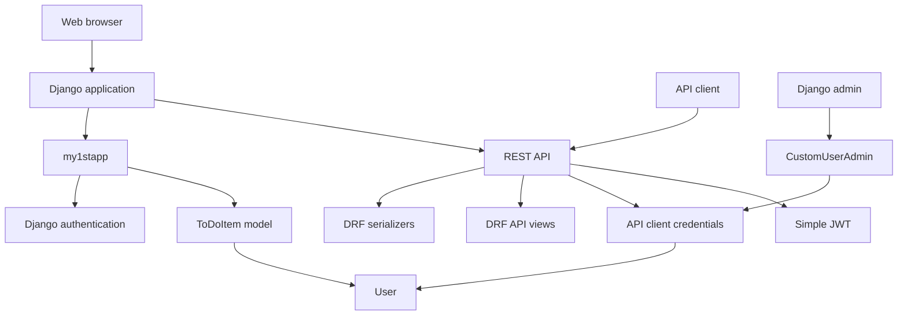
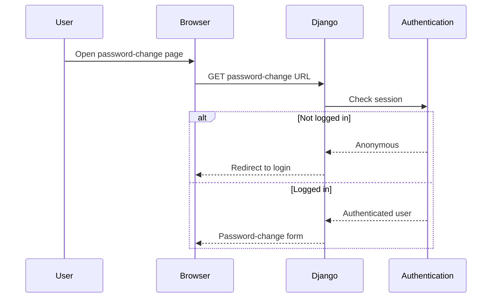
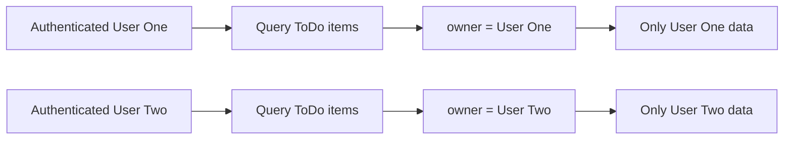
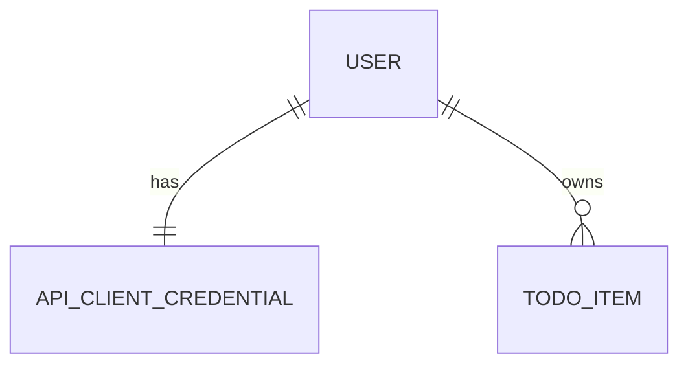
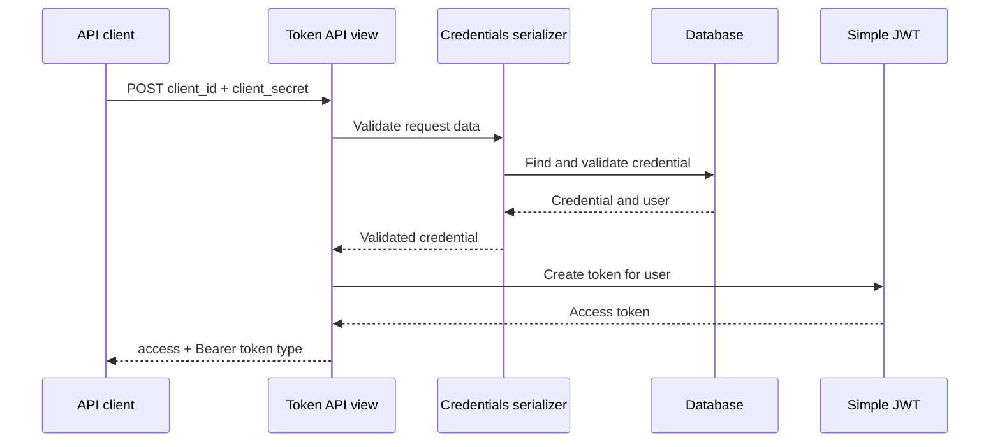
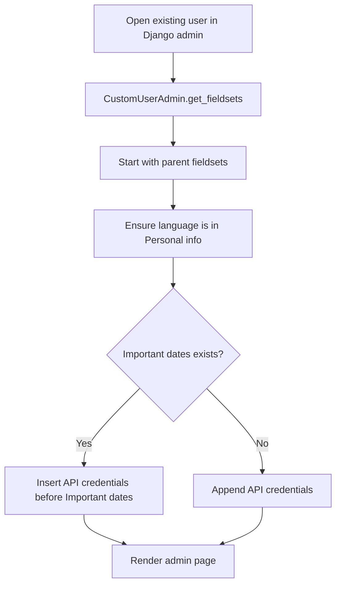
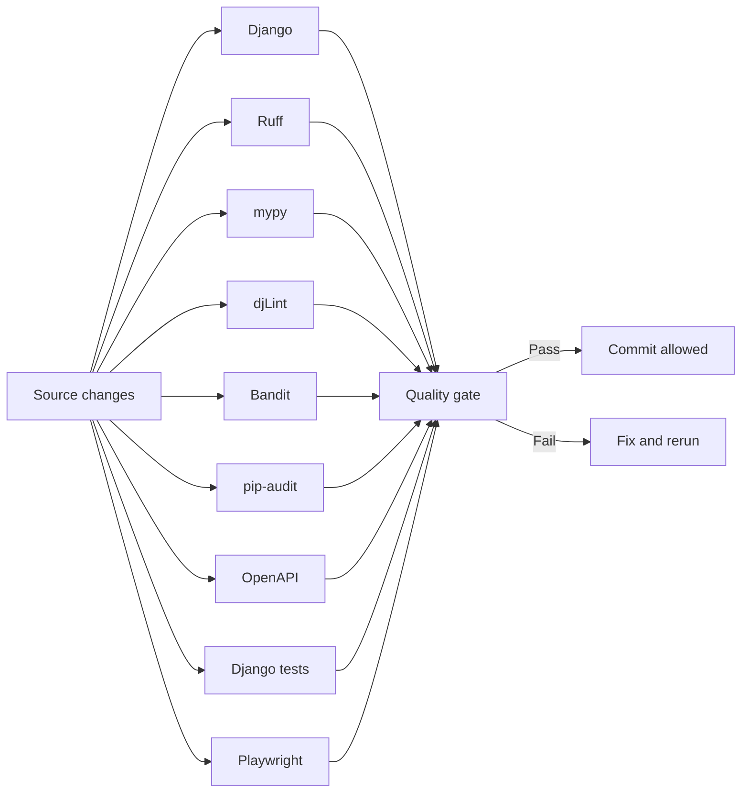

# Architecture Overview

## Overview

Jango101 is a Django project with two principal application areas:

- **`my1stapp`** — the main web application and user-facing functionality.
- **`api`** — the REST API, API credentials, serializers, API views, and custom administration.

The Django project package (`demo`) provides project-level configuration and application wiring.



# Application layers

## Project configuration

The `demo` project package provides Django configuration, including installed applications, middleware, URLs, authentication, database configuration, static files, and API/schema integration.

The type-checking setup uses the Django mypy plugin and django-stubs with:

```text
demo.settings
```

## Web application: `my1stapp`

Known functionality includes:

- user authentication flows
- password-change functionality
- user profile functionality
- user-owned ToDo data

The password-change tests cover both access control and successful password updates.



# REST API: `api`

The API application uses Django REST Framework and provides:

- authenticated user information
- user-owned ToDo operations
- API client credential validation
- JWT access-token issuance

## Who Am I endpoint

`WhoAmIView` requires authentication and returns:

- user ID
- username
- email address

## ToDo ownership boundary

The ToDo API filters data using the authenticated request user. The detail endpoint uses the same ownership boundary.



# API client credentials

`APIClientCredential` is associated one-to-one with a user and stores:

- generated client ID
- hashed client secret
- active flag
- creation timestamp
- update timestamp

The model generates values when required during saving. Client secrets are stored using Django password hashing rather than as raw values.



# Client-credentials token flow

The token endpoint validates submitted credentials through a serializer, obtains the associated user, and creates a JWT access token.



# Django admin

`CustomUserAdmin` provides:

- custom user creation and change forms
- custom CSS and JavaScript
- language in the Personal info fieldset
- an API credentials section
- read-only credential display for existing users

The API credentials fieldset is inserted before **Important dates** when that fieldset exists; otherwise it is appended.



# Type checking

The project uses:

- `mypy`
- `django-stubs`
- `djangorestframework-stubs`
- `mypy_django_plugin`

The project was verified with:

```text
Success: no issues found in 57 source files
```

The exact count may change as the project grows.

# Quality architecture


