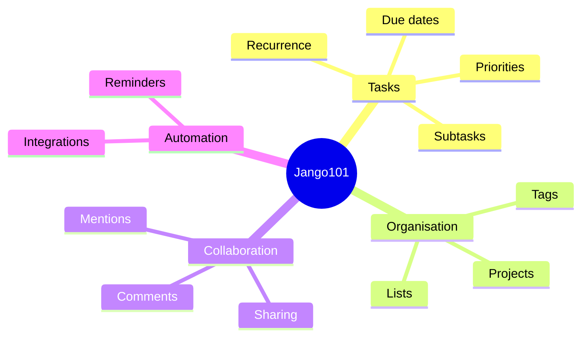
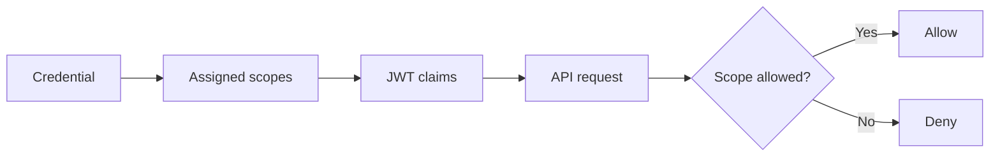
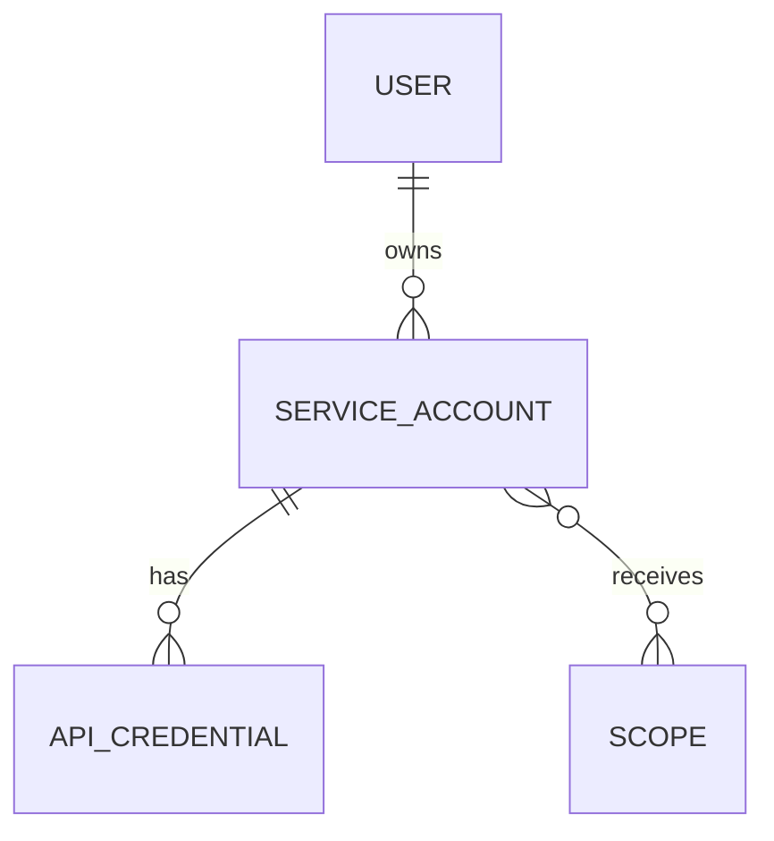
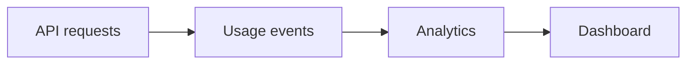
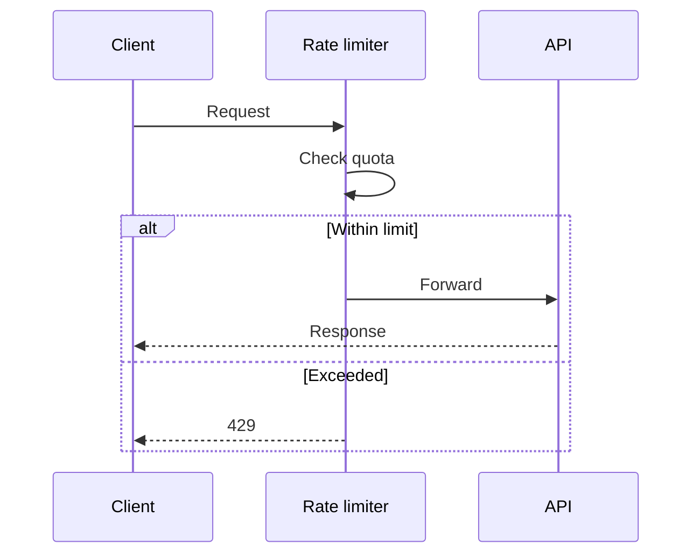
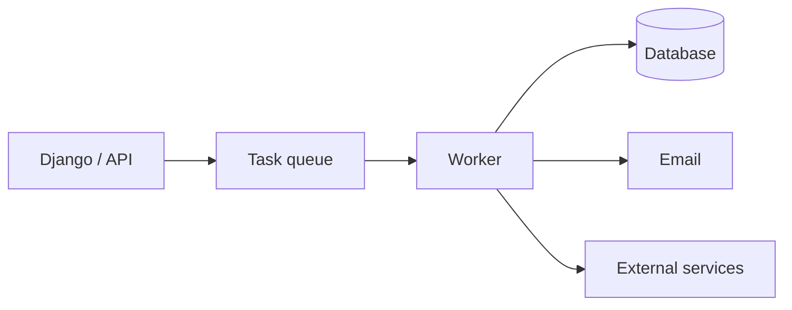
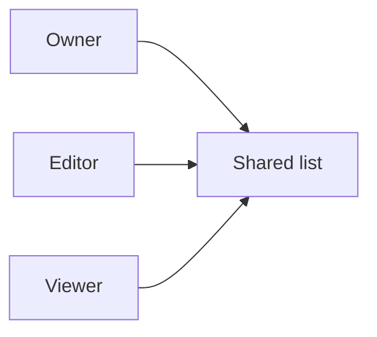
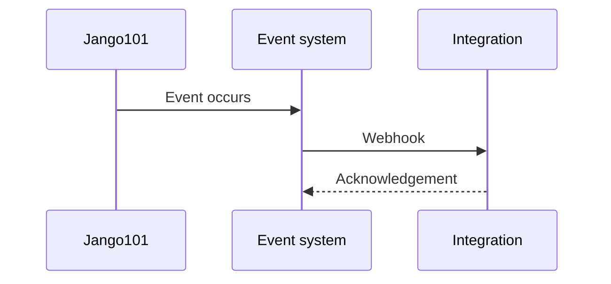
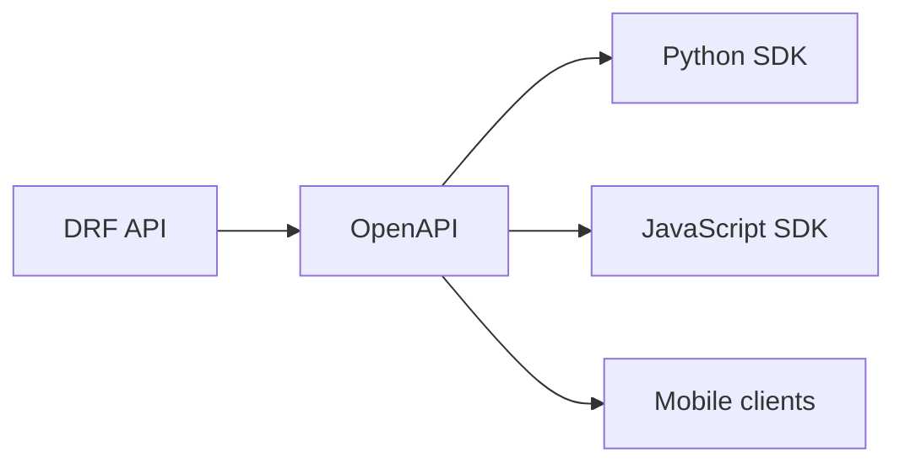
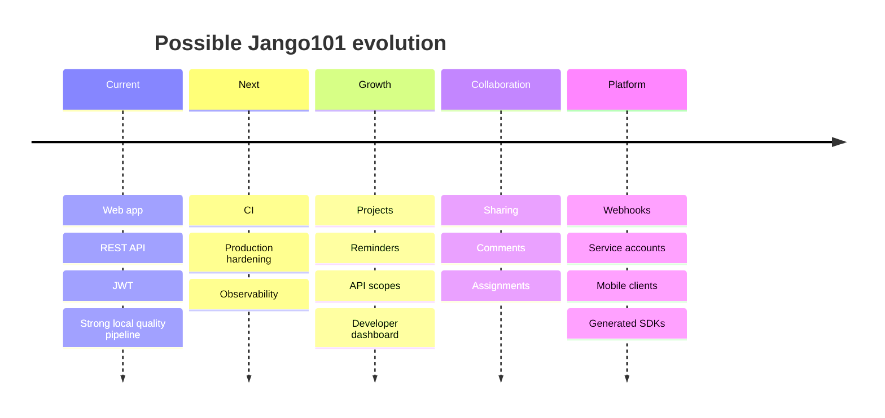

# Blue Sky Thinking: Future Enhancements

This document explores possible future directions for Jango101. These are intentionally aspirational ideas rather than a committed roadmap.

# 1. Evolve the ToDo application into a productivity platform

Possible additions:

- due dates
- priorities
- tags
- recurring tasks
- reminders
- subtasks
- projects
- attachments
- archived tasks



# 2. API scopes and fine-grained permissions

Future scopes could include:

```text
todos:read
todos:write
profile:read
credentials:manage
```



# 3. Service accounts

Introduce machine identities separate from human users for:

- integrations
- CI jobs
- automation
- external services



# 4. User-facing developer dashboard

Build on the existing API credential capability with a dashboard where users can:

- create credentials
- regenerate secrets
- deactivate credentials
- manage scopes
- view last-used timestamps
- inspect API activity

# 5. API analytics

Track:

- requests by credential
- endpoint usage
- authentication failures
- error rates
- latency
- rate-limit events



# 6. Rate limiting

Potential policies:

- per IP
- per user
- per API credential
- per endpoint



# 7. Background jobs

Useful for:

- reminders
- recurring tasks
- reports
- credential expiry notifications
- webhook delivery



# 8. Notifications

Potential channels:

- in-app
- email
- browser
- future mobile push notifications

Examples include task reminders, credential expiry and security events.

# 9. Collaboration

Possible future features:

- shared lists
- assignments
- comments
- mentions
- roles
- activity history



# 10. Webhooks and integrations

Possible events:

```text
todo.created
todo.updated
todo.completed
credential.rotated
```



# 11. Search and smart lists

Future search could support:

```text
status:open tag:work due:this-week
```

This could evolve into:

- saved searches
- smart lists
- filtered dashboards

# 12. Internationalisation

The existing language concept could become a foundation for:

- translated templates
- language preferences
- timezone preferences
- locale-aware dates

# 13. Progressive Web App

A PWA could provide:

- installability
- mobile-friendly UX
- offline access
- background synchronisation

# 14. Real-time updates

Collaboration could eventually justify:

- WebSockets
- live task updates
- live comments
- assignment notifications

# 15. Mobile clients and generated SDKs

The existing OpenAPI foundation could support:



# 16. Feature flags

Feature flags could support:

- beta functionality
- gradual rollout
- internal-only features
- controlled experiments

# 17. AI-assisted productivity

Potential AI features:

- convert natural language into tasks
- summarise projects
- suggest priorities
- identify dependencies
- draft task descriptions

Principle:

> AI suggests; the user remains in control.

# Possible long-term evolution



# Most promising directions

## Near term

- projects and task organisation
- due dates and reminders
- developer credential dashboard
- API scopes

## Platform maturity

- CI
- observability
- rate limiting
- service accounts
- webhooks

## Larger product evolution

- collaboration
- mobile clients
- PWA
- generated SDKs
- AI-assisted productivity

## Final thought

The application already has strong engineering foundations. Future work can increasingly focus on **capability and user value** rather than repeatedly rebuilding quality controls.

The best rule for blue-sky development is:

> Add complexity only when it unlocks a real capability.
