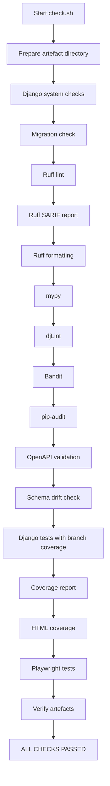
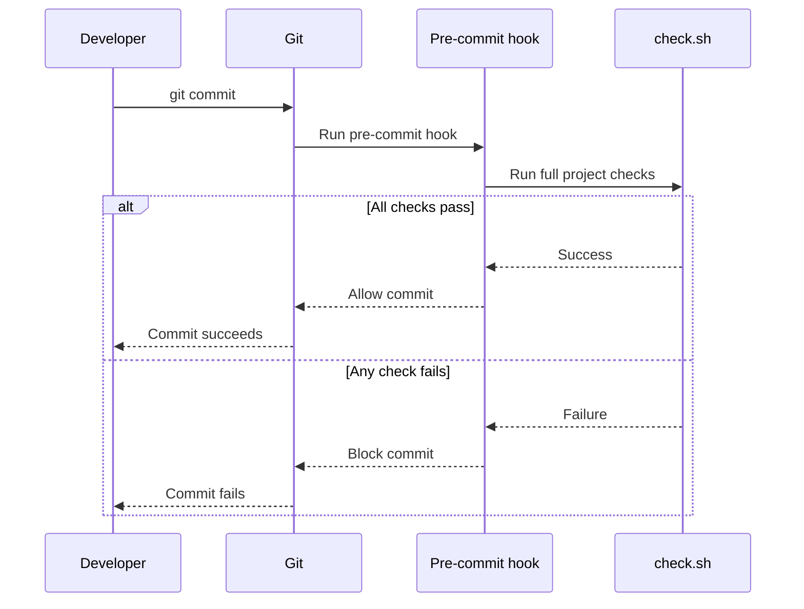
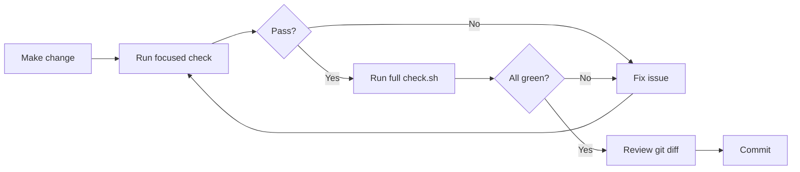

# Running, Testing, and Fixing Failed Commits

This guide explains how to run Jango101 locally, execute its checks, and fix the application when a pipeline or commit fails.

# Prerequisites

The project uses `uv` for Python tooling and commands.

You need:

- Python compatible with the project requirement
- `uv`
- project dependencies
- Playwright browser dependencies required by the browser test suite

The project configuration requires Python 3.12 or newer.

# Install dependencies

From the repository root:

```bash
uv sync
```

# Run Django

```bash
cd demo
uv run python manage.py migrate
uv run python manage.py check
uv run python manage.py runserver
```

# Run the complete pipeline

From the repository root:

```bash
./scripts/check.sh
```

This is the preferred final validation before committing.

# Run individual checks

## Django system checks

```bash
cd demo
uv run python manage.py check
```

## Missing migrations

```bash
cd demo
uv run python manage.py makemigrations --check --dry-run
```

## Ruff linting

From the repository root:

```bash
uv run ruff check .
```

## Ruff formatting

Check:

```bash
uv run ruff format --check .
```

Apply formatting:

```bash
uv run ruff format .
```

## mypy

```bash
cd demo
uv run mypy api my1stapp
```

A healthy result is:

```text
Success: no issues found in 57 source files
```

The count may change as the application grows.

## Bandit

```bash
cd demo
uv run bandit -r api my1stapp --exclude "api/tests,my1stapp/tests"
```

## pip-audit

```bash
uv run pip-audit
```

## OpenAPI schema validation

```bash
cd demo
uv run python manage.py spectacular --file schema.yml --validate
```

The pipeline also verifies that the generated schema matches the committed `schema.yml`.

## Django tests and branch coverage

```bash
cd demo
uv run coverage run --branch --source=api,my1stapp manage.py test
uv run coverage report -m
```

Generate HTML coverage:

```bash
uv run coverage html
```

The project was verified at 100% coverage during the current implementation work.

## Playwright tests

The standard project path is to run:

```bash
./scripts/check.sh
```

This also produces the configured Playwright report and failure artefacts.

# Pipeline flow



The script uses:

```bash
set -euo pipefail
```

Therefore a failing command stops the pipeline rather than allowing later checks to hide the failure.

# Git hooks

The pre-commit configuration runs the full project check:

```text
./scripts/check.sh
```

A post-commit hook runs:

```text
./scripts/archive.sh
```

after a successful commit.



# If a commit fails: fix the application

Do not treat a failed commit as a Git problem first. Read the first failing tool and fix the underlying application issue.

## 1. Identify the first failure

The pipeline stops at the command that failed. Fix that problem first.

## 2. Reproduce the failure directly

Examples:

```bash
uv run ruff check .
```

```bash
cd demo
uv run mypy api my1stapp
```

```bash
cd demo
uv run python manage.py test
```

Focused execution provides faster feedback while fixing the issue.

## 3. Make the smallest correct fix

Prefer fixing the application instead of weakening the tooling.

Examples:

- fix an incorrect type rather than adding an unnecessary `# type: ignore`
- fix a failing test rather than deleting the assertion
- add a migration when the model genuinely changed
- update the OpenAPI schema when the API contract intentionally changed
- fix insecure code rather than broadly excluding it from Bandit

Suppressions should be exceptional and justified.

## 4. Rerun the failing check

Continue until the focused command passes.

## 5. Rerun the complete pipeline

From the repository root:

```bash
./scripts/check.sh
```

A focused check passing is not enough: the complete pipeline verifies that the fix did not affect another part of the application.

## 6. Commit again

Once all checks are green:

```bash
git status
git add <files>
git commit -m "Describe the change"
```

# Troubleshooting by failure type

## Django system check failure

```bash
cd demo
uv run python manage.py check
```

Fix the reported configuration or application issue, then rerun the command.

## Missing migration

```bash
cd demo
uv run python manage.py makemigrations
```

Review the generated migration, then verify:

```bash
uv run python manage.py makemigrations --check --dry-run
```

## Ruff

```bash
uv run ruff check .
uv run ruff format --check .
```

Formatting can be applied with:

```bash
uv run ruff format .
```

## mypy

Read the file, line number, and error code such as `[attr-defined]` or `[arg-type]`.

In this Django project, check whether the problem is caused by:

- an incorrect annotation
- an optional value that has not been narrowed
- a Django or DRF object typed too generically
- missing or incorrect framework typing support

Preserve useful static checking rather than weakening it unnecessarily.

## Test failure

Determine whether:

- the application behaviour changed intentionally
- the test expectation is outdated
- the change introduced a regression

Do not change tests merely to make them pass unless the expected behaviour intentionally changed.

## Coverage regression

```bash
cd demo
uv run coverage report -m
```

Use the missing-line report to identify untested behaviour and add meaningful tests.

## OpenAPI schema drift

If the API changed intentionally:

1. regenerate the schema
2. validate it
3. review the diff
4. commit the updated schema with the API change

If the API did not intentionally change, investigate the difference.

## pip-audit failure

Identify the vulnerable dependency and determine whether:

- a patched version is available
- the version constraint can be updated safely
- the dependency is still required

# Artefacts

The pipeline stages generated reports under:

```text
.artifacts/
```

These include:

- Ruff SARIF output
- Bandit HTML output
- pip-audit Markdown output
- generated OpenAPI schema
- drf-spectacular report output
- HTML coverage
- Playwright output and report

# Recommended development loop



> Fix the application, prove the fix locally, then commit.
