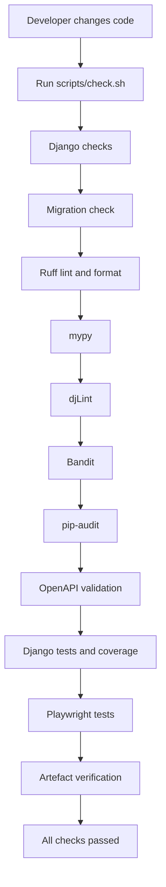

# Jango101

Jango101 is a Django application combining a traditional web application with a REST API. It includes authentication, user profile and password-change functionality, user-owned ToDo items, API client credentials, JWT access tokens, Django admin customisation, and a comprehensive local quality pipeline.

## What is included

### Web application
- Django authentication
- Login-protected user functionality
- Custom password-change flow
- User profile functionality
- User-owned ToDo data

### REST API
- Authenticated “Who Am I” endpoint
- ToDo list/create endpoint
- ToDo detail/update/delete endpoint
- Client-credentials token endpoint
- JWT access tokens using Simple JWT
- OpenAPI schema generation and validation with drf-spectacular

### Administration
- Custom `UserAdmin`
- Language field integrated into user fieldsets
- Embedded API client credential display
- Credential status display
- Client-secret regeneration support

### Quality controls
- Django system checks
- Migration drift checks
- Ruff linting and formatting
- mypy static type checking
- djLint template checks
- Bandit security scanning
- pip-audit dependency scanning
- OpenAPI schema validation and drift detection
- Django tests with branch coverage
- HTML coverage reports
- Playwright browser tests
- Generated artefact verification
- Git pre-commit and post-commit hooks

## Quick start

From the repository root:

```bash
uv sync
cd demo
uv run python manage.py migrate
uv run python manage.py runserver
```

## Run the complete local pipeline

From the repository root:

```bash
./scripts/check.sh
```

The pipeline acts as a quality gate: if a required check fails, the script stops until the underlying issue is fixed.

## Documentation

- [Architecture overview](ARCHITECTURE.md)
- [Running, testing, and fixing failed commits](DEVELOPMENT.md)

## Quality pipeline



## Repository layout

```text
jango101/
├── pyproject.toml
├── .pre-commit-config.yaml
├── scripts/
│   ├── check.sh
│   └── archive.sh
└── demo/
    ├── manage.py
    ├── demo/
    │   └── settings.py
    ├── api/
    │   ├── models.py
    │   ├── serializers.py
    │   ├── views.py
    │   ├── user_admin.py
    │   └── tests/
    ├── my1stapp/
    │   ├── models.py
    │   ├── templates/
    │   └── tests/
    ├── templates/
    └── schema.yml
```

The repository may contain additional files not shown above.
