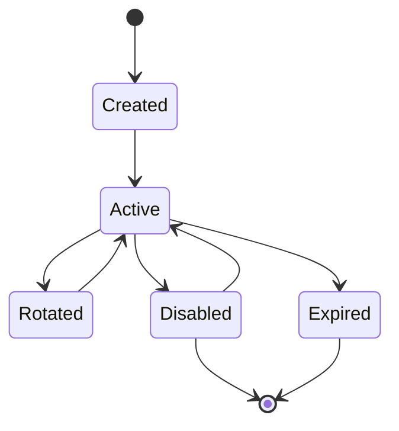
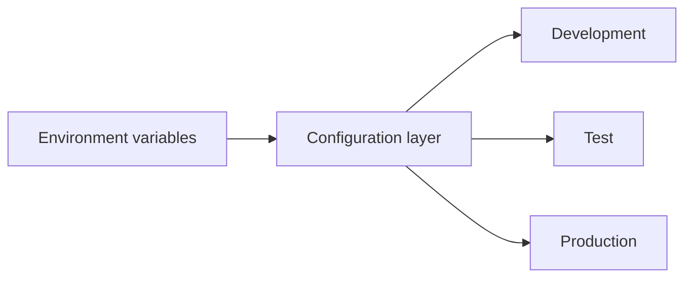
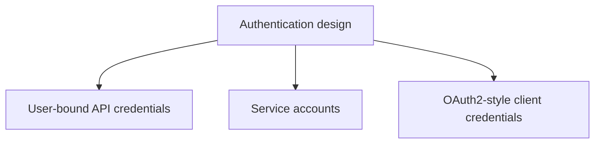
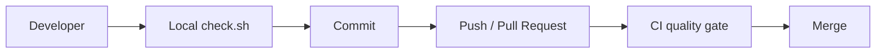
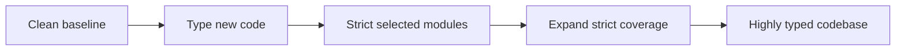
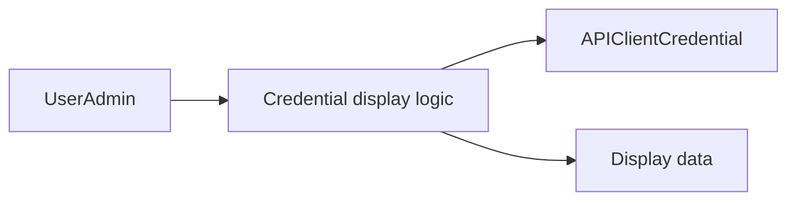

# Technical Debt and Prioritised Remediation Plan

This document identifies technical debt visible from the current Jango101 solution. The project is in a strong position: the full local pipeline is green, mypy passes across the checked source, and coverage is 100%. These are therefore mostly architectural and operational improvements rather than known broken code.

## Priority model

- **P1 — High:** address before significant production or product growth.
- **P2 — Medium:** plan deliberately as the application matures.
- **P3 — Lower:** monitor and address when growth justifies the change.

# P1 — High priority

## 1. Formalise the API client secret lifecycle

The application has generated client IDs, hashed client secrets, an active flag, and secret regeneration. The lifecycle should now be made explicit.

Questions to resolve:

- How is the raw secret initially delivered?
- Can it ever be retrieved again?
- Does regeneration immediately invalidate the previous secret?
- Should credentials expire?
- Should creation, rotation, activation and deactivation be audited?



Recommended direction: explicit rotation semantics, optional expiry, audit logging, and documented one-time secret presentation.

---

## 2. Formalise production deployment and security configuration

The local development pipeline is strong, but production configuration should be explicitly designed and tested.

Review and document:

- `DEBUG`
- `SECRET_KEY`
- `ALLOWED_HOSTS`
- HTTPS
- secure cookies
- CSRF trusted origins
- environment variable validation
- database configuration
- static files
- deployment checks



---

## 3. Make an explicit architectural decision about API identity

The solution currently validates client credentials and issues JWT access tokens for the associated user.

Clarify whether the intended model is:



The current approach may be correct for the application. The debt is primarily the lack of a documented boundary and future evolution path.

---

## 4. Add CI enforcement

Local hooks are excellent, but they can be bypassed or differ between developer machines.

The same essential quality checks should run in CI:



Prefer reusing the same commands already proven locally.

# P2 — Medium priority

## 5. Gradually tighten the mypy policy

The project currently has a clean mypy baseline, but `disallow_untyped_defs = false`.

A sensible staged approach is:

1. Require annotations for new production code.
2. Enable stricter checking for selected modules.
3. Expand strictness incrementally.
4. Avoid a disruptive all-at-once rewrite.



---

## 6. Add observability

Static analysis and tests cannot diagnose runtime production failures.

Plan for:

- structured logging
- error reporting
- request correlation IDs
- health checks
- basic metrics
- security-relevant audit events

Never log passwords, client secrets, or JWTs.

---

## 7. Define API compatibility and versioning policy

The project already has OpenAPI generation and schema drift validation. Define what constitutes a breaking API change and how clients will be supported.

Potential future path:

```text
/api/v1/...
/api/v2/...
```

Do not version merely for fashion; first define the compatibility policy.

---

## 8. Review the one-to-one credential assumption

The current one-user/one-credential relationship is simple and appropriate.

Future requirements might include:

- multiple integrations per user
- credential labels
- environment-specific credentials
- scopes
- service accounts

Document the current assumption and redesign deliberately if product requirements change.

---

## 9. Define generated artefact lifecycle

The pipeline generates reports under `.artifacts`.

Clarify:

- whether the directory is ignored by Git
- whether reports are archived
- whether CI publishes reports
- how long artefacts should be retained

# P3 — Lower priority

## 10. Reduce admin presentation coupling as the admin grows

`CustomUserAdmin` currently handles credential lookup, display decisions, URL construction and substantial HTML rendering.

That is reasonable today. If the admin expands, consider a clearer separation:



Do not over-engineer this prematurely.

---

## 11. Review test architecture as the suite grows

100% coverage is an excellent baseline.

Watch for:

- very large test classes
- duplicated setup
- repeated credential creation
- excessive mocking

Factories and reusable test utilities may eventually become worthwhile.

# Recommended order

1. **P1:** Credential lifecycle
2. **P1:** Production security configuration
3. **P1:** API identity decision
4. **P1:** CI enforcement
5. **P2:** Gradually stricter typing
6. **P2:** Observability
7. **P2:** API compatibility policy
8. **P2:** Credential scalability review
9. **P2:** Artefact lifecycle
10. **P3:** Admin separation
11. **P3:** Test architecture refinement

## Summary

The strongest technical debt is not basic code quality. The application has already established a strong engineering baseline through automated tests, 100% coverage, mypy, security scanning, OpenAPI validation and a comprehensive local pipeline.

The next maturity step is primarily about **production readiness, explicit security boundaries, operational visibility and CI enforcement**.
